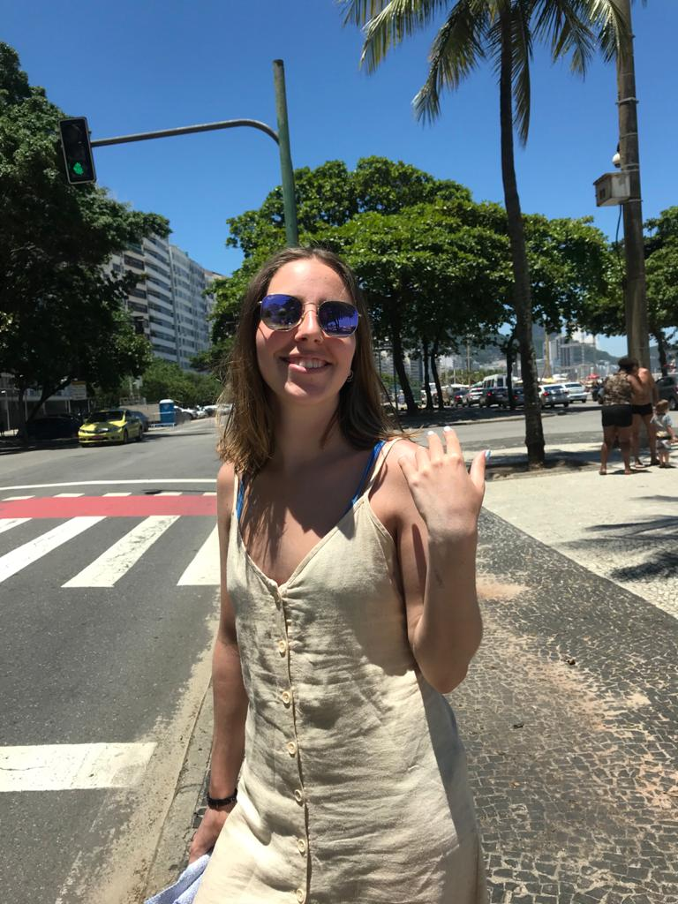

## Buenas! Como estan? Mi nombre es Delfina. 
##### Legajo: 164.307-1

Acá les dejo mi foto para que me conozcan un poco:

 

Y ahora les voy a contar un poquito de mi. Mi nombre es Delfina Maria Costanzo Papadopulos y ya se lo que deben estar pensando, tengo el nombre mas largo del mundo. Seguramente el mas largo de la facultad(chequeado). Tengo 21 años y vivo en Coghlan con mi mama y mi hermana y tengo 4 mascotas hermosas <3 (3 gatos y un perro). En cuanto a mis gustos, me encanta hacer ejercicio, juntarme/salir con mis amigos, mirar series/películas, entre otras cosas. Me resulta re difícil elegir una película favorita pero el puesto esta peleado entre *las películas de Marvel* y *La isla siniestra*. Y mi serie favorita es *Friends*.

Con respecto a la programación, yo entre a la universidad sin saber absolutamente NADA de programación pero al pasar el tiempo, empeze a aprender un montón de cosas. Tengo conocimientos de **C++/C** y actualmente estoy haciendo un curso de desarrollo web donde aprendo sobre **Javascript**, **CSS** y **HTML**. 

No estoy trabajando actualmente, pero me encantaría en el futuro hacer alguna pasantía o algún trabajo part-time. 

Espero que todos tengan un muy lindo año!

Saludos!!

